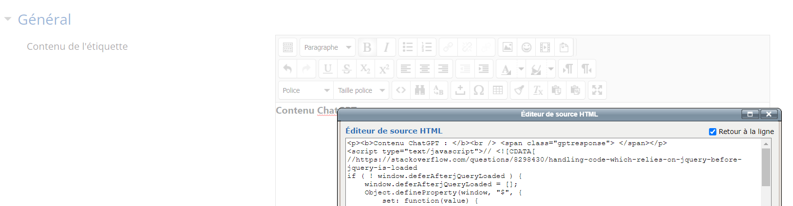
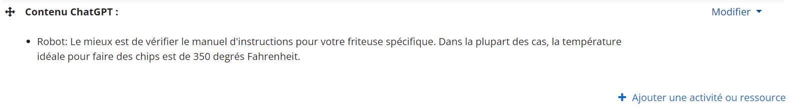

# StudiUM-GPT : démo 01

## Description
Cette démo permet d'intégrer une réponse provenant de ChatGPT dans une ressource StudiUM / Moodle.

## Fonctionnement
1. Un script JavaScript est intégré dans une ressource de cours (par exemple une [étiquette](https://docs.moodle.org/3x/fr/%C3%89tiquette)).
2. Une requête est expédiée par le navigateur web au serveur web Node.js, pour obtenir le contenu provenant de ChatGPT a intégrer dans la ressource.
3. ChatGPT répond au serveur web Node.js, qui va retourner le résultat au navigateur web.
4. Le navigateur ajoutera le contenu à l'emplacement prévu.

## Prérequis
. [Node.js](https://nodejs.org) (testé avec la version 18.15 Windows) et la librairie [`openia`](https://github.com/openai/openai-node).

## Installation et configuration
1. Intégrer le code HTML et JavaScript (voir dossier `Moodle`) dans la ressource de cours StudiUM. Pour ce faire, vous aurez besoin d'utiliser l'option `Éditeur code source HTML`.
   Au besoin, configurer l'adresse du serveur web Node.JS.
   .
2. Exécuter le serveur web Node.js.
   Pour la démonstration, il est possible d'exécuter Node.JS sur le même ordinateur que celui sur lequel est exécuté le navigateur (mais ce n'est pas très discret en contexte réel de triche!).
   . Configurer la clé et l'URL de l'API utilisées pour communiquer avec ChatGPT.
   . Au besoin, revoir la configuration du modèle de langage utilisé.

## Démonstration
.